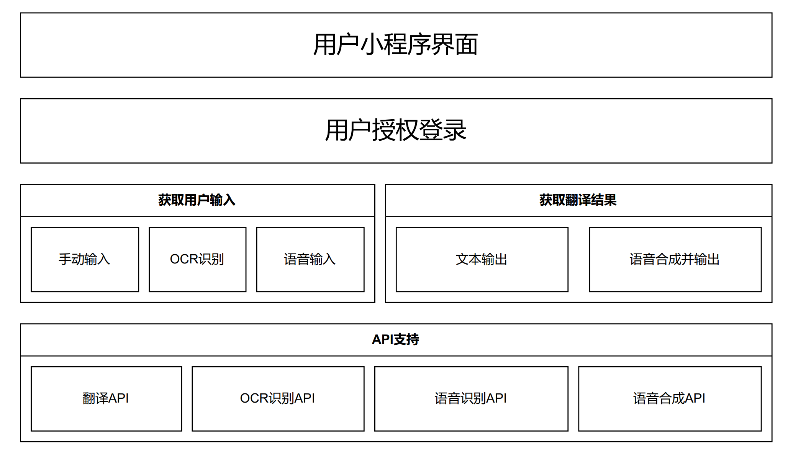

# 1. 项目概述

## 1.1 项目基本介绍

<div align="center">
    
</div>
<div align = "center">
	<h1 align = "center">TransWe</h1>    
    <h4 align = "center">Translate WeChat Mini Program</h4>
    简体中文
	&nbsp;&nbsp;| &nbsp;&nbsp;
	<a href="https://github.com/dekrt/TransWe/blob/main/README-en.md">English</a>
    <br>
    <br>
    <a href = "https://dekrt.cn/"></a>
    
    <a href = "https://github.com/dekrt/TransWe"></a>
    <a href = "https://github.com/dekrt/TransWe/issues"></a>
</div>

## 📱 UI界面

<div align = "center">
    
    
    
    
    
</div>


## 📖 项目介绍

**TransWe**意为`Translation+Wechat`，是一个功能强大的机器翻译微信小程序，它能够通过后台机器翻译服务快速、准确地翻译各种语言。它还支持第三方OCR、语音识别和语音合成集成，为用户提供更便捷、高效的翻译服务。

TransWe功能包括：

1. 机器翻译：TransWe使用后台机器翻译服务，支持多种语言翻译，包括英语、中文、法语、德语、日语、韩语等，能够准确、快速地翻译用户的文本。
2. OCR识别：TransWe支持第三方OCR识别，用户只需要上传图片或拍摄照片，就能将图片中的文字转换为文本进行翻译。
3. 语音识别：TransWe支持第三方语音识别，用户只需要录制音频，就能将音频中的语音转换为文本进行翻译。
4. 语音合成：TransWe支持第三方语音合成，用户能够将翻译结果通过语音合成功能转换为语音输出，提高用户的交互体验。

TransWe使用简单，功能强大，只需选择需要翻译的语言，输入要翻译的文本，点击“翻译”按钮，TransWe将自动完成翻译，如果需要使用OCR识别、语音识别或语音合成功能，可以选择相应功能按钮，按照提示进行操作即可。同时TransWe还是一款完全免费的小程序，旨在为用户提供更便捷、高效的翻译服务。无论是旅行、学习还是工作，TransWe都能帮助用户轻松应对语言难题。

## 🤝 项目成员

<p>
    <a href="https://github.com/dekrt"></a>
    <a href="https://github.com/chendeting88"></a>
</p>


TransWe由张骁凯和陈德霆共同开发完成。

## 🚀 功能特性

**TransWe**是一款集多种功能于一身的微信小程序，旨在为用户提供便捷、高效的翻译服务。以下是TransWe的主要功能特性：

1. **多语言机器翻译**：TransWe支持多种语言的翻译，包括但不限于英语、中文、法语、德语、日语、韩语等。我们的后台机器翻译服务能够快速、准确地翻译用户的文本，满足用户在不同场景下的翻译需求。
2. **OCR识别**：TransWe集成了第三方OCR识别技术，用户只需上传图片或拍摄照片，我们的小程序就能将图片中的文字识别出来，转换为文本进行翻译。这一功能特别适用于处理图片中的外语文字，极大地提高了用户的翻译效率。
3. **语音识别**：TransWe支持第三方语音识别技术，用户只需录制音频，我们的小程序就能将音频中的语音识别并转换为文本进行翻译。这一功能使得用户在无法输入文字时，仍然可以轻松获取翻译服务。
4. **语音合成**：TransWe集成了第三方语音合成技术，用户可以将翻译结果转换为语音输出，提高了用户的交互体验，特别适用于视力不便或者需要听力辅助的用户。

TransWe的使用非常简单，用户只需选择需要翻译的语言，输入要翻译的文本，我们的小程序就会自动完成翻译。如果用户需要使用OCR识别、语音识别或语音合成功能，只需选择相应的功能按钮，按照提示进行操作即可。

TransWe是一款完全免费的小程序，我们的目标是为用户提供最便捷、高效的翻译服务。无论是旅行、学习还是工作，TransWe都能帮助用户轻松应对语言难题，让语言交流变得无障碍。

## 🧱 目录结构描述

```
.
├─code                              //代码文件夹
│  ├─assets
│  │  └─iconfont
│  ├─components					    //组件文件夹
│  │  ├─bottom-button
│  │  ├─modal
│  │  ├─play-icon
│  │  ├─result-bubble
│  │  └─waiting-icon
│  ├─imgs						    //小程序内部图片文件夹
│  ├─pages
│  │  ├─change					    //切换语言
│  │  ├─choose_language			    //选择语言
│  │  ├─edit					    //文本编辑页面
│  │  ├─getPic					    //获取图片
│  │  ├─history						//翻译历史
│  │  ├─history_test				//翻译历史前端测试
│  │  ├─index						//主页
│  │  ├─index_test					//主页前端测试
│  │  ├─OCR							//拍照翻页界面
│  │  └─voice_translation			//语音翻译界面
│  ├─TDD_test_cdt					//TDD开发语音翻译
│  ├─TDD_test_zxk					//TDD开发文本翻译
│  └─utils							//插件
│      api.js						//翻译api接口
│      conf.js
│      md5.min.js					//获取MD5加密
│      util.js
├─docs
│      API.md						//API接口文档
│      CurriculumDesignReport.md	//课设报告文档
│      SystemArchitecture.md		//系统架构文档
│      SystemDesign.md				//系统设计文档
│      SystemRequirement.md			//系统需求文档
│      UI_Design.md					//UI设计文档
│      UserRequirement.md			//用户需求文档
└─pics
```

## ⬇️ 版本内容更新

- **2023/06/02 TransWe v1.0**: 基本实现全部功能

## 📃 协议

 [](https://github.com/dekrt/TransWe/blob/main/LICENSE)

>**警告**
>
>除GPLv3许可下的源代码外，其他方均禁止使用TransWe的名义作为下载器应用，TransWe的衍生产品亦同。
>衍生品包括但不限于分叉和非官方构建。


## 1.2 Github仓库地址

[TransWe](https://github.com/dekrt/TransWe): <https://github.com/dekrt/TransWe>

## 1.3 人员基本分工

### 1.3.1 **张骁凯**（负责人）：

张骁凯将主要负责项目的后端开发工作，包括但不限于：

1. 负责Github仓库管理：
2. 将需求作为Issue录入：
3. 
4. **机器翻译服务**：负责与后台机器翻译服务的接口开发和维护，确保翻译服务的准确性和效率。
5. **数据库管理**：负责数据库的设计和管理，确保用户数据的安全和完整。
6. **性能优化**：负责系统的性能优化，确保系统在高并发情况下的稳定运行。

### 1.3.2 **陈德霆**（副负责人）：

陈德霆将主要负责项目的前端开发和用户体验设计，包括但不限于：

1. **用户界面设计**：负责用户界面的设计和开发，确保用户界面的易用性和美观性。
2. **OCR和语音识别功能**：负责OCR识别和语音识别功能的集成和测试，确保这些功能的正常运行。
3. **用户反馈**：负责用户反馈功能的开发，收集用户的反馈和建议，以便持续改进我们的产品。

# 2. 需求描述

## 2.1 功能性描述

### 2.1.1 用户需求

#### 1 集成翻译服务（Translation Service）

1. 用户需求：

- 用户在输入框中输入文字，选择输入语言与目标语言，程序在输出框中给出翻译结果。

2. 用户需求标识：**TransWe-UR-TS**

#### 2 集成第三方OCR功能（Optical Character Recognition）

1. 用户需求：

- 用户可以选择使用图片转文字服务（OCR），并进行拍照（或选择图库中的图片）进行翻译。

2. 用户需求标识 ：**TransWe-UR-OCR**

#### 3 集成第三方语音识别(Speech Recognition):

1. 用户需求：

- 用户选择输入语言及目标语言，通过语音进行输入，程序以文字形式展示输入结果与翻译结果。

2. 用户需求标识：**TransWe-UR-SR**

#### 4 集成第三方语音合成（Speech Synthesis）

1. 用户需求：

- 用户在翻译完成后点击发声按钮，程序将翻译结果以语音的形式进行输出。

2. 用户需求标识：**TransWe-UR-SS**

### 2.1.2 系统需求

#### 1 基础翻译功能（TransWe-SR-TS）

1. **初始假设：** 

-  用户在输入框中输入文字，选择输入语言与目标语言，程序在输出框中给出翻译结果。

2. **正常状态：** 

-  用户在输入框中输入待翻译的文本，**程序会自动检测输入语言**，用户在下拉菜单中选择相应的目标语言。
-  用户也可以**手动选择输入语言**。输入完成后，程序将进行翻译并在输出框中显示翻译结果。

3. **有哪些会出错：**

- 输入的文本中包含无法识别的字符或语言。程序会提示用户重新输入或手动选择语言。 
- 输入的文本过长或复杂，程序无法进行翻译。程序会提示用户缩短输入文本或尝试其他翻译方式。
- 网络连接不稳定，程序无法进行翻译。程序会提示用户检查网络连接并重试。

4. **其他活动：**

- 用户可以在下拉菜单中选择默认语言，程序会在下一次启动时自动选择该语言。
- 程序会记录用户的翻译历史，并允许用户在历史记录中查看以前的翻译结果。 

5. **完成的系统状态：** 

- 用户可以通过打开程序，并进入翻译界面来进行翻译。程序会自动检测输入语言，并在下拉菜单中选择相应的目标语言。
- 用户在输入框中输入待翻译的文本后，程序会进行翻译并在输出框中显示翻译结果。
- 程序记录了用户的翻译历史，并允许用户在历史记录中查看以前的翻译结果。

#### 2 集成第三方OCR功能的脚本（TransWe-SR-OCR）

1. **初始假设：** 

- 用户需要使用一个微信翻译小程序，该小程序集成了第三方OCR功能，用户可以通过拍照或上传照片将图片中的待翻译文本识别成目标语言并显示到图片上。

2. **正常状态：** 

- 用户打开小程序，选择OCR功能，进入拍照界面。用户可以**使用手机摄像头拍下待识别的图片**，也可以**按下图库按钮上传照片**。进入图片编辑界面后，**用户可以选择整张图片或者框选一部分图片**，用户需要选择待翻译的语言种类和目标语言种类。检测到用户按下翻译按钮时，系统应该调用OCR服务对目标图片进行文字识别，并在界面上显示识别结果。

- 系统应该允许用户在翻译后重新选择图片，重新选择翻译语言并进行翻译。

3. **有哪些会出错：**

- 系统权限不足，无法访问用户图库。
- 第三方OCR功能出现故障，导致无法完成文字识别。

4. **其他活动：**

- 系统应该保证用户隐私，不记录用户的OCR识别记录。
- 系统应该对用户图库进行保护，确保不被未授权的其他脚本访问。

5. **完成的系统状态：** 

- 用户可以通过OCR功能成功识别图片中的文字并进行翻译。

#### 3 语音识别功能（TransWe-SR-SR）

1. **初始假设：** 

- 用户希望通过语音输入来输入翻译内容，系统需要进行语音识别功能，将语音转换为文本，再进行翻译操作。

2. **正常状态：** 

- 用户点击语音输入按钮，系统开始录音并将录音转换为文本格式，并输出到屏幕上。 
- 系统对文本**进行分词**并进行翻译操作。
- 翻译结果以文本形式**呈现在界面上**。

3. **有哪些会出错：**

- 语音输入的质量不好，无法被识别成文本。系统应该提示用户录音质量不好，请重试。 
- 翻译服务不可用或异常。系统应该提示用户翻译服务暂时不可用，请稍后再试。

4. **其他活动：**

- 系统应该保证用户隐私，不记录用户的语音输入内容。
- 系统应该对录音文件进行保护，确保不被未授权的人访问。

5. **完成的系统状态：** 

- 用户可以通过语音输入方式进行翻译操作。
- 系统可以对语音进行识别并将其转换为文本格式。 
- 系统可以对文本进行分词和翻译操作，将翻译结果呈现在界面上。

#### 4 语音合成功能（TransWe-UR-SS）

1. **初始假设：** 

- 用户希望通过语音的形式来输出翻译内容，系统需要进行语音合成功能，将文本转换为语音，再通过扬声器播放。

2. **正常状态：** 

- 用户正常进行翻译后，点击语音输出按钮，系统开始进行语音合成并将翻译结果以**语音的形式进行输出**。
- 翻译结果以**文本形式呈现**在界面上。

3. **有哪些会出错：**

- 系统语音合成功能出现故障，无法将文本正确转换为语音。
- 扬声器或音频设备出现故障，无法正常播放语音。

4. **其他活动：**

- 当正在播放合成的语音时，图标的颜色将会改变；播放完成后回到原来的颜色。

5. **完成的系统状态：** 

- 用户可以通过语音输入并输出翻译内容，系统可以将文本转换为语音，并通过扬声器播放出来。系统记录了用户的输入和输出内容，并可以对其进行分析和统计。

## 2.2 非功能性需求

### 1 **性能需求**：

- 翻译响应时间：对于用户输入的文本，系统应在1秒内返回翻译结果。
- OCR识别和语音识别的处理时间：对于用户上传的图片或音频，系统应在5秒内完成识别并返回结果。
- 系统应能够支持高并发请求，即在用户量剧增的情况下，系统的性能不会显著下降。

### 2 **安全性需求**：

- 用户的个人信息和使用数据应得到充分保护，不得泄露给第三方。
- 系统应具备防止恶意攻击的能力，如DDoS攻击、SQL注入等。

### 3 **可用性需求**：

- 系统的正常运行时间应达到99.9%。
- 在出现故障时，系统应能在1小时内恢复正常。

### 4 **可维护性需求**：

- 系统应具备良好的模块化和文档化，以便进行维护和升级。
- 系统应能够容易地添加新的语言支持和新的功能。

### **5 可扩展性需求**：

- 系统应设计成可扩展的架构，以便在未来可以添加更多的功能，如多语言支持、语音翻译等。

### 6 **用户体验需求**：

- 系统的用户界面应简洁易用，用户能够快速理解如何使用各项功能。
- 系统应提供用户反馈功能，用户可以方便地报告问题和提出建议。

# 3.  **系统设计**

## 3.1 **架构设计**

我们的翻译小程序采用分层架构的架构模式，架构示意图如下：



### 1 表示层（Presentation Layer）

表示层是用户与系统交互的界面，包括用户界面、数据输入、输出等。这一层主要负责将用户请求传递给下一层，并将处理结果返回给用户。在我们的翻译软件中，表示层包括用户输入文本的界面、显示翻译结果的界面、对翻译结果进行输出的页面等，以及获取用户的授权信息。

### 2 应用层（Application Layer） 

应用层是系统的核心层，它实现了翻译的核心算法和业务逻辑，包括文本处理、翻译算法等。这一层主要负责接收并处理表示层传递的请求，然后调用其他层的服务，最后将处理结果返回给表示层。在我们的小程序中，应用层负责：

1. 获取用户输入：
   - 手动输入
   - OCR识别
   - 语音输入
2. 获取输出结果：
   - 文本输出
   - 语音合成输出

### 3 服务层（Service Layer） 

服务层为应用层提供支持，包括网络通信、数据访问、存储等服务。这一层主要负责处理数据的存储和访问，以及与其他系统的交互。在我们的翻译软件中，服务层可以包括调用翻译接口获取翻译结果、调取OCR接口获取OCR识别结果、调取语音合成API对翻译结果进行语音输出等。

总的来说，以上三个层级构成了一个完整的翻译软件系统，每个层级都负责不同的功能，各司其职。这种分层架构模式使得系统更加清晰、易于扩展和维护。

## 3.2**界面原型设计**

### 1. 主页面（Main Page）

主页是小程序的入口，包括小程序的基本信息和主要功能模块。页面包含四个模块，分别是文字翻译，录音按钮、OCR翻译按钮和翻译历史记录。

- **文本输入框**：用户可以在这个框中手动输入需要翻译的文本。
- **翻译框**：用户输入文本、点击这个按钮开始翻译。
- **语音播放器**：用户点击播放语音。
- **语言选择器**：用户可以在这里选择源语言和目标语言。
- **语音按钮**：用户可以点击这个按钮，跳转到语音翻译页面。
- **OCR按钮**：用户可以点击这个按钮，跳转到语音OCR页面。
- **翻译历史按钮**：用户可以点击这个按钮，跳转到翻译历史页面。

### 2.语言选择页（Settings Page）

语言选择页提供用户多种翻译语言。用户可以选择支持的语言。

- **语言设置**：用户可以在这里更改默认的源语言和目标语言。

### 3.语音翻译页（Voice Translation Page）

语音翻译页是用户输入需要翻译的语音的页面。页面主要包括录音按钮、语言选择器和翻译结果框。翻译结果框会以卡片形式保存下来，用户可以编辑录入的文字。

- **录音按钮**：位于页面下方，用户可以点击此按钮开始进行语音输入，输入的语音将被实时转化为文字并显示在结果框内。
- **语言选择器**：位于页面顶部，用户可以在此一键切换中英文。
- **翻译结果框**显示用户录音输入的文字以及翻译结果。翻译结果以卡片形式保存并展示，每个卡片包括原文和译文，用户可以删除不要的卡片。
- **编辑按钮**：每个翻译结果卡片右上角都会有一个编辑按钮，用户点击后可以对录入的文字进行编辑，编辑完成后翻译结果将自动更新。
- **返回按钮**：页面左上角有一个返回按钮，用户点击后可以返回主页面。

### 4.OCR拍照翻译页面（OCR  Translation Page）

OCR拍照翻译页面是用户能够通过拍照进行翻译的地方。

- **拍照按钮**：用户可以点击这个按钮，利用手机相机进行拍摄，完成拍摄后，系统会自动进行识别并将图片中的文字进行翻译。
- **翻译结果展示区**：系统完成翻译后，翻译结果将会在这个区域显示，用户可以查看翻译结果。

### 5.翻译历史页（Translation History Page）

翻译历史页面保存用户之前的文字翻译和语音翻译记录。

- **翻译历史**：用户可以划动屏幕查询所有的本地翻译记录。每条历史以卡片形式保存并展示，每个卡片包括原文和译文。

## 3.3 **详细设计**

### 3.3.1. 组件设计

<div align = "center">
    
</div>


### 3.3.2. 组件接口设计

#### 1 数据库接口

<div align = "center">
    
</div>


- `saveTranslationRecord(record: TranslationRecord): void`：保存翻译记录。
- `getTranslationRecords(userId: String): List<TranslationRecord>`：获取指定用户的翻译记录列表。

#### 2 语言设置接口


<div align = "center">
    
</div>


- `sourceLanguage: String`：源语言属性。
- `targetLanguage: String`：目标语言属性。
- `setSourceLanguage(sourceLanguage: String): void`：设置源语言。
- `setTargetLanguage(targetLanguage: String): void`：设置目标语言。
- `getSourceLanguage(): String`：获取源语言。
- `getTargetLanguage(): String`：获取目标语言。

#### 3 OCR翻译接口


<div align = "center">
    
</div>


- `recognizeImage(image: ImageData, sourceLanguage: String, targetLanguage: String): String`：将图像数据识别为文本，并将其翻译成指定的目标语言。

#### 4 语音翻译接口


<div align = "center">
    
</div>


- `recognizeSpeech(audio: AudioData, sourceLanguage: String, targetLanguage: String): String`：将音频数据识别为文本，并将其翻译成指定的目标语言。

#### 5 文本翻译接口


<div align = "center">
    
</div>


- `translateText(text: String, sourceLanguage: String, targetLanguage: String): String`：将指定的文本翻译成指定的目标语言。

#### 6 用户界面接口


<div align = "center">
    
</div>


- `showTextInputBox(): void`：显示文本输入框。
- `showTranslationResult(text: String): void`：显示翻译结果。
- `showVoiceInputButton(): void`：显示语音输入按钮。
- `showOCRButton(): void`：显示 OCR 按钮。
- `showHistoryButton(): void`：显示历史记录按钮。
- `showVoiceAndCopy(): void`：显示语音合成和复制按钮。

#### 7 语音录入接口


<div align = "center">
    
</div>


- `getVoice(text: String, targetLanguage: String): AudioData`：将指定的文本转换为语音，并返回音频数据。
- `copyText(text: String): void`：将指定的文本复制到剪贴板。

#### 8 页面控制接口

<div align = "center">
    
</div>


- `+getToPage(page: String)`：表示该接口具有一个公共方法 `getToPage`，该方法接受一个参数 `page`，类型为 `String`，用于获取指定页面的内容。

#### 9 API信息配置接口

<div align = "center">
    
</div>


- `-api_config: ApiConfig`：表示该接口具有一个私有属性 `api_config`，其类型为 `ApiConfig`。私有属性只能在该类内部访问。
- `+setApiConfig(api_config : ApiConfig)`：表示该接口具有一个公共方法 `setApiConfig`，该方法接受一个参数 `api_config`，类型为 `ApiConfig`，用于设置 `api_config` 的值。
- `+getApiConfig(): ApiConfig`：表示该接口具有一个公共方法 `getApiConfig`，该方法返回 `api_config` 的值，类型为 `ApiConfig`。

#### 10 翻译记录

<div align = "center">
    
</div>


- `userId: String`：用户 ID 属性。
- `sourceText: String`：源文本属性。
- `sourceLanguage: String`：源语言属性。
- `targetText: String`：目标文本属性。
- `targetLanguage: String`：目标语言属性。
- `timestamp: DateTime`：时间戳属性。
- `getUserId(): String`：获取用户 ID。
- `getSourceText(): String`：获取源文本。
- `getSourceLanguage(): String`：获取源语言。
- `getTargetText(): String`：获取目标文本。
- `getTargetLanguage(): String`：获取目标语言。
- `getTimestamp(): DateTime`: 获取时间戳。

### 3.3.3 系统流程分析


<div align = "center">
    
</div>


结合上述用例图，我们得出以下的时序图：

#### 1 文本翻译时序图

<div align = "center">
    
</div>


#### 2 拍照翻译时序图

<div align = "center">
    
</div>


#### 3 语音翻译时序图

<div align = "center">
    
</div>


#### 4 语音合成时序图

<div align = "center">
    
</div>


#### 5 查看翻译历史时序图

<div align = "center">
    
</div>
